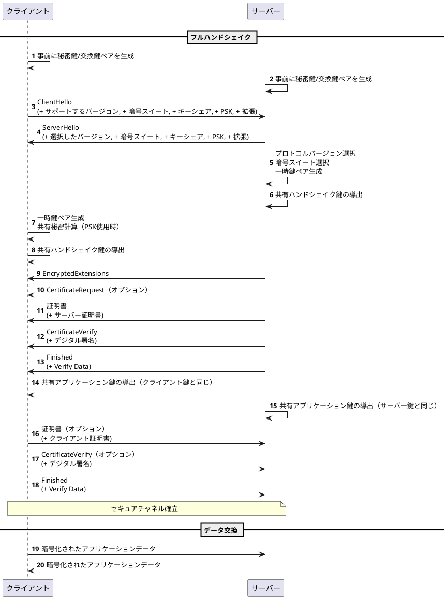

# TLSのRPCを読むために

[TLS 1.3 RFC 8446](https://tex2e.github.io/rfc-translater/html/rfc8446.html)

## 目的

実際に実装することでTLSをざっくり知る。

## 参考に使えるやつ

[The Illustrated TLS 1.3 Connection](https://tls13.xargs.org/)

## 実装

Rustlsはもちろん使用しない。

- 非同期ランタイムはtokioを使用する
- 暗号のライブラリを使用する[Rust Crypto](https://github.com/RustCrypto)
- その他できるだけライブラリは使う

 tlsは主に二つにの主要コンポーネントで構成されている。

- 通信相手を認証し、暗号化モードとパラメーターをネゴシエートし、共有キー情報を確立するハンドシェイクプロトコル（セクション4）。 ハンドシェイクプロトコルは、改ざんに耐えるように設計されています。 アクティブな攻撃者は、接続が攻撃を受けていない場合にピアとは異なるパラメータをネゴシエートさせることはできません。
- ハンドシェイクプロトコルによって確立されたパラメータを使用して、通信するピア間のトラフィックを保護するレコードプロトコル（セクション5）。 レコードプロトコルは、トラフィックを一連のレコードに分割します。各レコードは、トラフィックキーを使用して個別に保護されます。

</img>

[DH鍵共有](https://ja.wikipedia.org/wiki/%E3%83%87%E3%82%A3%E3%83%95%E3%82%A3%E3%83%BC%E3%83%BB%E3%83%98%E3%83%AB%E3%83%9E%E3%83%B3%E9%8D%B5%E5%85%B1%E6%9C%89)を使って公開鍵方式を用いて通信し共有鍵を共有する。

- とりあえずミニマムで実装パターン。
- 全体像何をしているのか。

## TLS 1.3　シーケンス図

#### 用語
- ClientHello: クライアントからサーバーへの最初のメッセージ。サポートするバージョン、暗号スイート、キーシェア、PSK、拡張などの情報を含む。
- ServerHello: サーバーからクライアントへの応答メッセージ。選択したバージョン、暗号スイート、キーシェア、PSK、拡張などの情報を含む。
- EncryptedExtensions: サーバーからクライアントへの暗号化された拡張情報を含むメッセージ。
- CertificateRequest: サーバーからクライアントへの証明書要求メッセージ。オプションであり、クライアント認証が必要な場合に送信される。
- Certificate: サーバーからクライアントへの証明書を含むメッセージ。サーバー証明書を含む。
- CertificateVerify: デジタル署名を含むメッセージ。証明書が正当であることを証明するために送信される。
- Finished: ハンドシェイクが完了したことを示すメッセージ。Verify Dataを含む。
- Application Data: クライアントとサーバー間で交換される暗号化されたアプリケーションデータ。
- PSK (Pre-Shared Key): 事前に共有された秘密鍵。通信相手との間で共有され、通信の安全性を確保するために使用される。
- Key Share: クライアントとサーバー間で共有される鍵交換の情報。
- Signature Algorithms: サーバーがサポートする署名アルゴリズムのリスト。
- Pre-Shared Key: クライアントとサーバー間で事前に共有された秘密鍵。
- Extensions: クライアントとサーバー間で交換される追加の情報。

